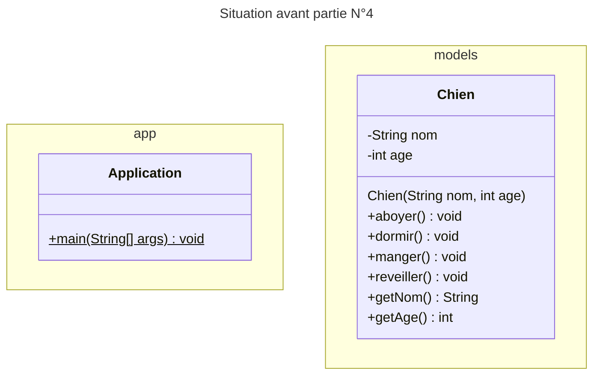
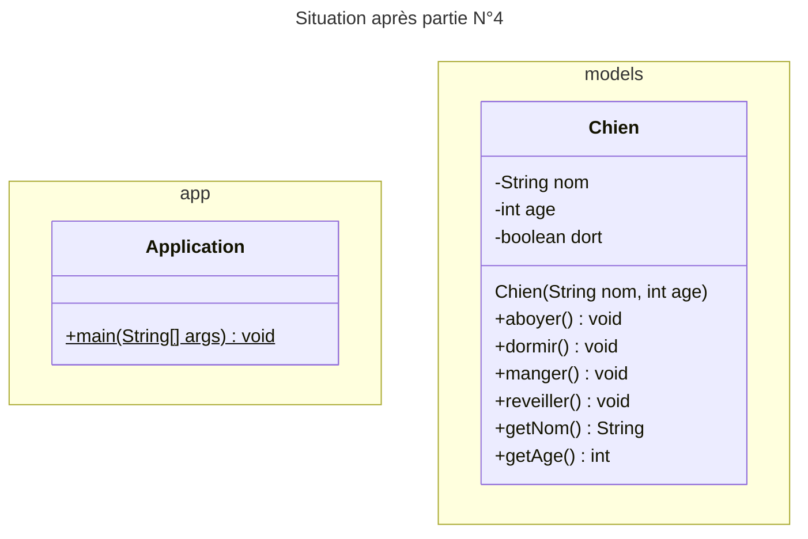

# Exercice 01 : Le chien - solution
## PARTIE 5 : Qu'est-ce qui a changé avec la partie 4 ?
Regardez avec attention les deux situations ci-dessous représentées l'aide d'un diagramme de classes UML et répondez aux questions :

# RETOURNER A LA CONSIGNE :
[Retourner à la consigne pour répondre aux questions](README.md)
